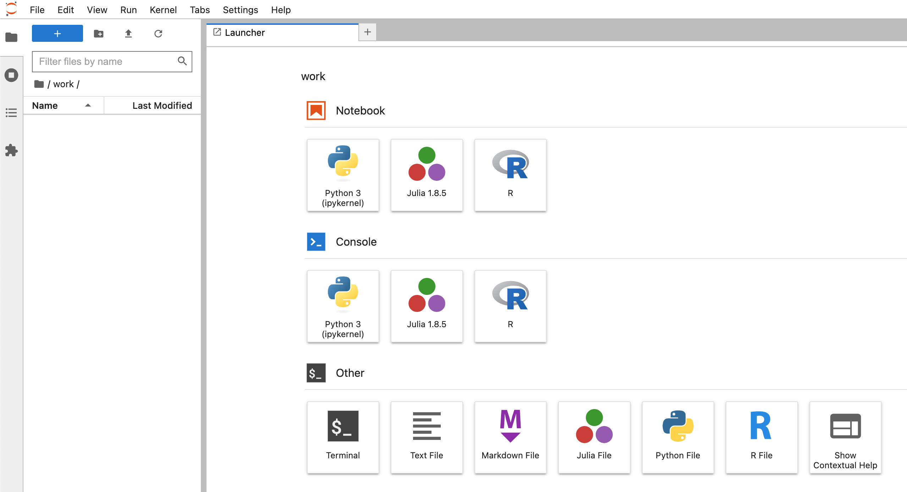
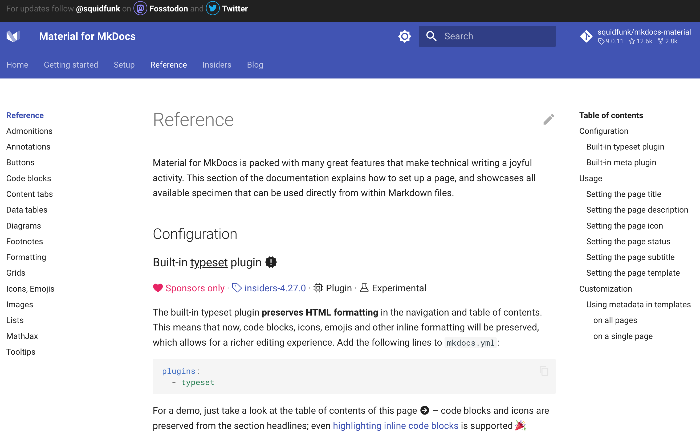

# Ubuntu-based mkdocs-material base-image, with Jupyter notebook included

[](https://github.com/marcelmaatkamp/mkdocs-material-jupyter/actions/workflows/main.yml)

Builds [ghcr.io/marcelmaatkamp/mkdocs-material-jupyter:${{env.MKDOCS_MATERIAL_VERSION}}](ghcr.io/marcelmaatkamp/mkdocs-material-jupyter:${MKDOCS_MATERIAL_VERSION})

This repo builds a ubuntu-based mkdocs-material with jupyter included. The originsl repo [squidfunk/mkdocs-material](https://github.com/squidfunk/mkdocs-material) is alpine based which conflict with alot of (interactive) visualisation plugins like [PyVista](https://docs.pyvista.org/) in jupyter notebook. 

This repo builds the following docker base image containers:
 * [marcelmaatkamp/mkdocs-material-jupyter](https://hub.docker.com/repository/docker/marcelmaatkamp/mkdocs-material-jupyter/general)
 * [ghcr.io/marcelmaatkamp/mkdocs-material-jupyter](ghcr.io/marcelmaatkamp/mkdocs-material-jupyter)

Repos extending this base image are:
 * [marcelmaatkamp/mkdocs-material-jupyter-pyvista](https://github.com/marcelmaatkamp/mkdocs-material-jupyter-pyvista)

# usage

## docker-compose 

### jupyter
```bash
$ docker-compose up jupyter
```
http://127.0.0.1:8888


### mkdocs 
```bash
$ docker-compose up mkdocs
```
http://127.0.0.1:8000/mkdocs-material/reference/

